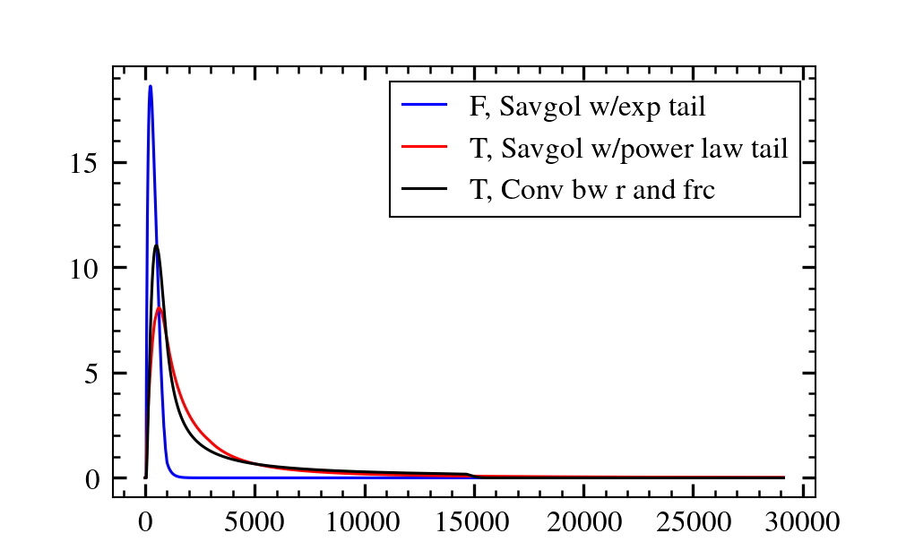

# Deconvolution of CESM2 data

## Looking at raw data

The raw data, median over an ensemble of four simulations, one for each season. Overlaid
are Savitzky-Golay filters, where the rise is swapped with a log func:

## Change tails

Now giving the forcing an exponentially decaying tail and the temperature a power law
tail:

## Extending the tails

Make the tails longer so that they (more or less) reach equilibrium (same as above, just
with longer exponential and power law tails):

## Synthetic signal

Now, create a custom response signal, convolve with extended forcing above so it come
close to the extended temperature above:

\begin{figure}[!h]
\caption{Extended forcing and temp, and new temp from convolving with response (right)}
\end{figure}

## Adding noise

Adding some noise to the forcing and the temperature from convolution in fig.\ (4);
still too little noise on the forcing compared to the ogiginal in fig.\ (1):

And this is what the deconvolution gives back when feeding it the noisy forcing and the
custom response:

\begin{figure}[!h]
\caption{Deconvolving F+N and R to give T estimate}
\end{figure}

## Train of pulses

Now appending the forcing to itself six times, then convolving and adding noise to the
outputted temperature signal. The added noise to the forcing is now increased to better
match the noise we have in the original from finding the median.

\begin{figure}[!h]
\caption{Train of pulses with additivie noise}
\end{figure}

From the deconvolution we now get something that very much has the same shape as the
original we are looking for:

\begin{figure}[!h]
\caption{Deconvolving (T+N) and (F+N) to get an estimate of R, with original overlaid}
\end{figure}
