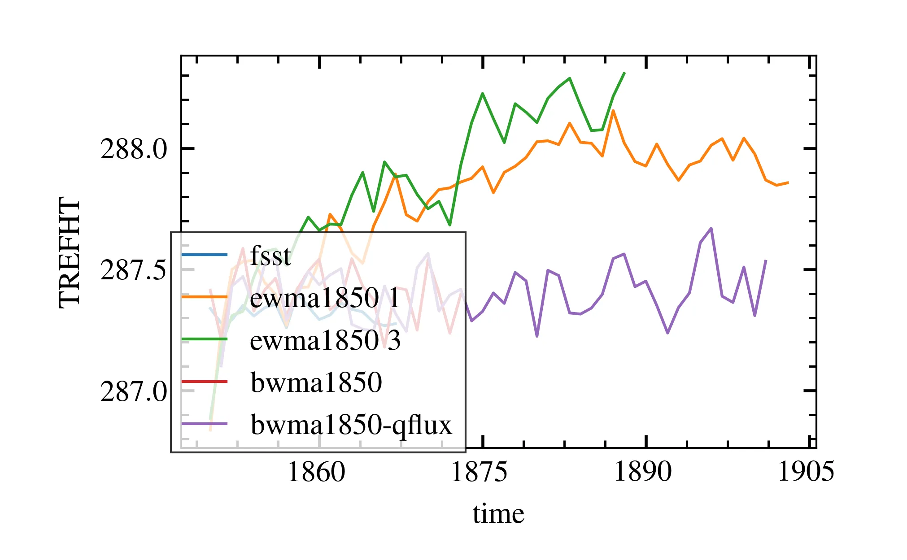
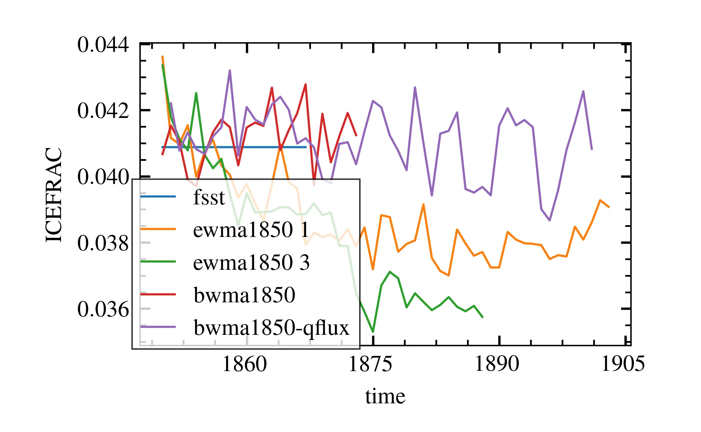

# Setting up slab ocean model

## Q-flux files

We first want to generate q-flux files that go with the slab ocean simulation, based on
the fully dynamical model.

We ran the **BWma1850** compset in its default setting from 1850 to 1902, and generated
the q-flux files based on the years 1856 to 1900. Below is a plot of the temperature
and ice fraction evolution during the whole control run.

In the above plots, the red line is the control run used to generate the q-flux files.

## Problems?

We also see some other simulations being plotted. In particular, the orange line is the
**EWma1850** compset, which is supposed to be the slab ocean model run with WACCM6
atmosphere. It is clear, however, that the ice fraction and surface temperature are not
stable and keep diverging far from the level of the control. Why is that?
